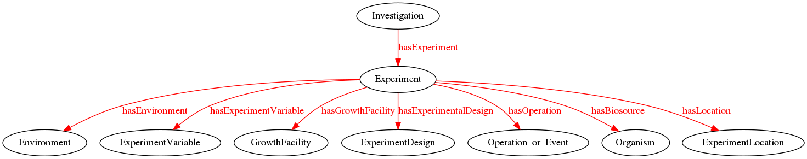
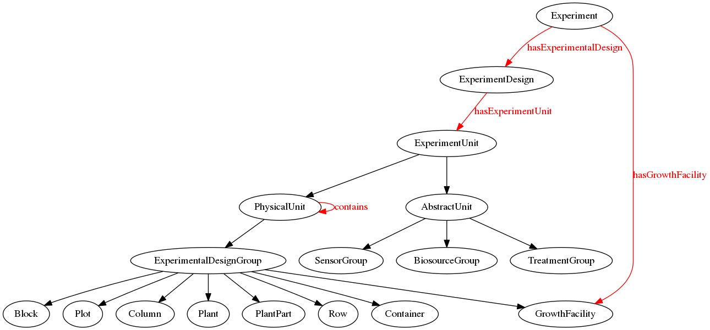
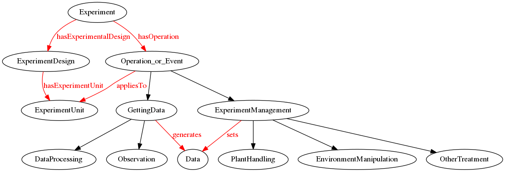
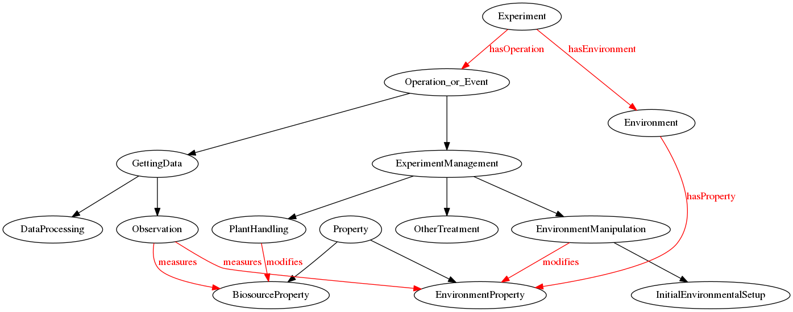
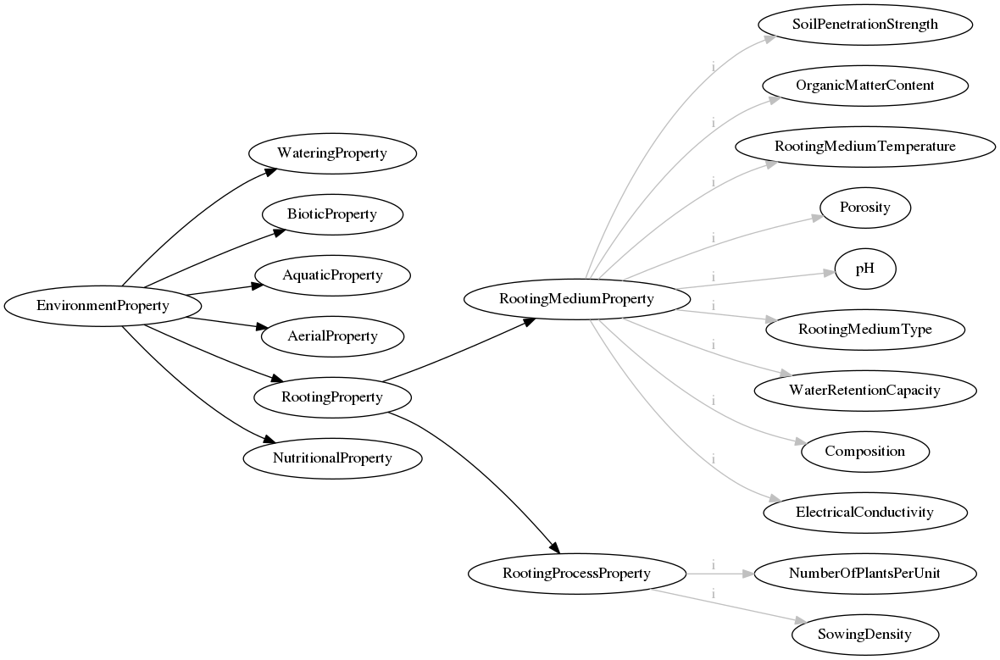
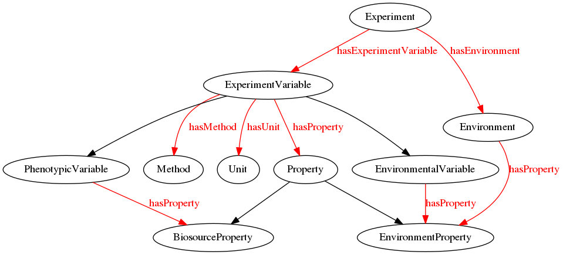

# miappe-model
Semantic modeling of the Minimum Information About a Plant Phenotyping Experiment (MIAPPE) for  description for phenotypic datasets. Work in progress.

Initially just adding a structure to the MIAPPE attribute list. Eventually, this should be a usable data model to consider for data management in EPPN2020 project, along with the French Phenome system.

## Overview of main concepts

The central concept is an **experiment**, representing a plant phenotyping study performed within a project or investigation. Experiment description contains the attributes from MIAPPE, most of which is grouped within the following concepts:

**Experiment design** describes the structure of the experiment in terms of assignment of basic **experimental units** to phisical and abstract groups. Phisical groups are agronomical units of different granularity (e.g. facility > blocks >  containers > individual plants > individual organs). Abstract groups represent subsets of experimental units that have something in common (e.g. biosource, treatment, sensor scope).

Experiment units are subject to **operations or events**. Operations include experiment management (i.e. setting some environmental parameters or plant treatment), tracking parameters of the experiment (i.e. observation of environmental parameters or plant traits) and data processing. Their result is setting or getting **Data** characterising particular action.

Each action, planned or spontenuous, is assigned to the unit affected, **property** involved, method, and time. Examples of operations or events are: watering of a plant group, rain in the whole field, or pH measurement for particular plot.

**Properties** include **plant phenotypic traits** and **environmental properties**. The former are assumed to be independent of MIAPPE model and to belong to any external ontology. The latter are supposed to conform to the MIAPPE requirements about plant study environmental attributes. Thus, in the current model draft, the basic attributes are explicitely named as individuals within the *environment property* hierarchy. The approach to the description of the environment will be further discussed and developed within EPPN2020 project.

Initially, we have modelled **Experimental Variables** according to the MIAPPE approach (borrowed from Crop Ontology / Bioversity group), i.e. as a tripet: Trait (Property), Method, Scale (Unit). Now, having added the concept of *Operations and Events* described by their own methods, this migth need to change. 

The MIAPPE model is supposed to serve as a scaffolding for phenotypic experiment description. Concrete implementation of concepts of Phenotypic Traits, Methods, Units, Institutions, Locations, Growth facilitets, etc. is assumed to come from dedicated external ontologies. (work in progress)
